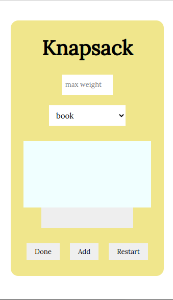

# JS Knapsack
Given a knapsack with a certain weight capacity, fill it with loot from a list of items to achieve the highest value possible.
## App

### Built with
- HTML
- CSS
- JavaScript
### Prerequisites
Knowledge about:
- HTML
- CSS
- JavaScript
- Google Chrome
### Clone project
Get a local copy of this project by following the steps below:
- Clone this repository using `git@github.com:Nathanael-Lontsi/knapsac.git`
- Move to the project directory by typing : cd JavaScript and cd knapsack in your terminal.
## Steps
- $ git clone `git@github.com:Nathanael-Lontsi/knapsac.git`
- $ `cd knapsack`
- $ `git checkout feature/jsknapsack`
## Start up
- Run by opening index.html using the browser
: bust_in_silhouette: **Nathanael-Lontsi**
## :handshake :Contributions
We welcome contributions, issues and feature request.
Feel free to check the [issues page](https://github.com/Nathanael-Lontsi/knapsac/issues)
## :memo :License
This project is [rebaseacademy](./LICENSE) licensed.